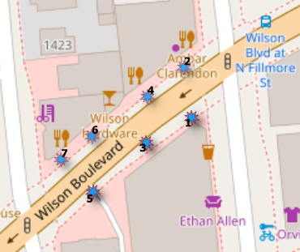

```{r setup, include=FALSE}
knitr::opts_chunk$set(echo = TRUE)

```

## R Markdown

This is an R Markdown document for October data. 

```{r echo=FALSE}

#

```


```{r cleaning data, include=FALSE}
library(readr)
library(lubridate)
library(tidyverse)

# for Windows
appear14 <- read_csv("../data/appearances 2022-10/appearances_2022-10-14.csv") %>% 
  # for MAC
  #appear14 <- read_csv("/Users/bb/Documents/Arlington/Arlington/data/Oct/appearances 2022-10/appearances_2022-10-14.csv") %>%
  select(ts, user_id, device_id, bird_view) %>% 
  mutate(timestamp = as.POSIXct(ts, tz='EST')) %>% 
  select(ts, timestamp, user_id, device_id, bird_view) %>% 
  mutate(did = str_replace(device_id, '-.*', '')) %>% 
  mutate(yes_no = if_else(grepl('^P', bird_view) == TRUE, "Yes", "No")) %>% 
  select(timestamp, user_id, did, bird_view, yes_no)
```

Let's review whether there are empty or non-assigned geo points for any cells.
```{r review, echo=FALSE, comment=NA}
appear14 %>% 
  select(yes_no) %>% count(yes_no)

```
Data seems to contain no empty cells for geographical location for each row cell.
```{r Counting timestamp, echo=FALSE, comment=NA}
did.table <- as.data.frame(appear14 %>% 
  select(timestamp, did) %>% 
  group_by(did) %>% count(did))
```
Let's review the device id (sensors) and its recordings as data frame.

```{r device id table, echo=FALSE}
did.table %>% 
  ggplot(aes(x=did, y=n, fill=did))+
  geom_bar(stat = 'identity')+
  ggtitle('Device ID and its Performance Chart, Oct 14, 2022') +
  xlab('Device ID') + 
  ylab('Number of Objects Detected by the Device id') +
  coord_flip()
```

```{r creating timeseries table, echo=FALSE, comment=NA}
appear14 %>% 
  select(timestamp, user_id, did) %>% 
  group_by(timestamp, did) %>% count(user_id) %>% 
  head()
```

```{r echo=FALSE, comment=NA}
seq.POSIXt(as.POSIXct('2022-10-14 00:00:00'), 
           as.POSIXct('2022-10-14 23:59:59'), by = "2 hour") %>% 
  head()

# We will look for missing values in the bird view column in the Appearance table.
# Do query on device id and its recordings. Whether there are times when device id does not produce any data
# Two-hours of time interval aggregation (timestamp column) and review the user id: its frequency, count, total number of   user id, sense of tracking individuals 
# Geo locations (bird view) into visible demonstration of area of the recordings
```
