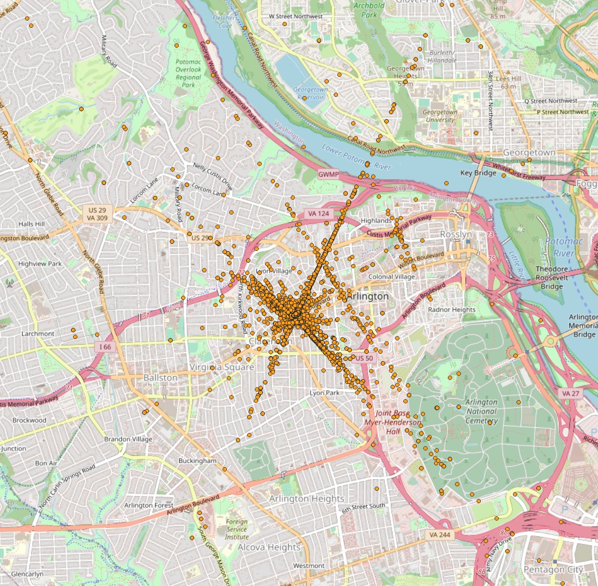

```{r setup, include=FALSE}
knitr::opts_chunk$set(echo = TRUE)

```

## R Markdown

This is an R Markdown document for October data. 


# Appearances Dataset
```{r cleaning data, include=FALSE, warning=FALSE}
library(readr)
library(lubridate)
library(tidyverse)

# for Windows
appear14 <- read_csv("../data/appearances 2022-10/appearances_2022-10-14.csv") %>% 
  # for MAC
  # appear14 <- read_csv("/Users/bb/Desktop/Oct/October/data/appearances 2022-10/appearances_2022-10-14.csv") %>%
  select(ts, user_id, device_id, bird_view) %>% 
  mutate(timestamp = as.POSIXct(ts, tz='EST')) %>% 
  select(ts, timestamp, user_id, device_id, bird_view) %>% 
  mutate(did = str_replace(device_id, '-.*', '')) %>% 
  mutate(yes_no = if_else(grepl('^P', bird_view) == TRUE, "Yes", "No")) %>% 
  select(timestamp, user_id, did, bird_view, yes_no)
```

Let's review whether there are empty or non-assigned geo points for any cells.
```{r review, echo=FALSE, comment=NA}
appear14 %>% 
  select(yes_no) %>% count(yes_no)

```
Data seems to contain no empty cells for geographical location for each row cell.
```{r Counting timestamp, echo=FALSE, comment=NA}
did.table <- as.data.frame(appear14 %>% 
  select(timestamp, did) %>% 
  group_by(did) %>% count(did))

did.table %>% head(5)
```
Let's review the device id (sensors) and its recordings as data frame.

```{r device id table, echo=FALSE}
did.table %>% 
  ggplot(aes(x=did, y=n, fill=did))+
  geom_bar(stat = 'identity')+
  ggtitle('Device ID and its Performance Chart, Oct 14, 2022') +
  xlab('Device ID') + 
  ylab('Number of Objects Detected by the Device id') +
  coord_flip()
```

```{r creating timeseries table, echo=FALSE, comment=NA}
appear14 %>% 
  select(timestamp, user_id, did) %>% 
  group_by(timestamp, did) %>% count(user_id) %>% 
  head(5)
```
## Main table setup for line graph
This is the main table initial setup for every two hours of interval analysis. Later we will integrate values from Appearances and Lines Crossed datasets to create aggregated relation between two datasets. This helps us to review how entries recorded by the sensors (device id) are put together as line graph.
```{r creating main time table, echo=FALSE, comment=NA}
timestamp <- seq.POSIXt(as.POSIXct('2022-10-14 00:00:00', tz='EST'), 
           as.POSIXct('2022-10-14 23:59:59', tz='EST'), by = "2 hour")

main_tbl <- as.data.frame(timestamp)
main_tbl %>% head()

# We will look for missing values in the bird view column in the Appearance table.
# Do query on device id and its recordings. Whether there are times when device id does not produce any data
# Two-hours of time interval aggregation (timestamp column) and review the user id: its frequency, count, total number of   user id, sense of tracking individuals 
# Geo locations (bird view) into visible demonstration of area of the recordings
```
## Spliting geo location points into separate columns (Graphical purpose).
Following snippet will extract the geo locational points from the Appearances dataset. Latitude and Longitude will splited into two columns from one column for easier graphical representation. 
```{r echo=FALSE, comment=NA}
# FUNC 4: remove parenthesis from POINT column and split the column into
rmove_parenthesis <- function(df){
        df$bird_view <- gsub('[()]', '', df$bird_view)
        df %>% 
                separate(bird_view, c('Point', 'Y', 'X'), sep = ' ')}
```


```{r echo=FALSE, comment=NA}
geo_tbl <- rmove_parenthesis(appear14)%>% 
  mutate(userid = str_replace(user_id, '-.*', '')) %>% 
  select(timestamp, Y, X, did, userid)

geo_tbl %>% head()
```
## Aggreagting user id in Appearances dataset
This aggregation will help us to count number unique user id (eventually count of an object or a person) every two hours of intervals. In other words, the unique user id for each object in two hours will be counted as on person grouped by device id. Device id and user id are shortened as their first eigth characters from the original long strings. This helps to identify quickly and improve readability. 
```{r echo=FALSE, comment=NA}
geo_tbl %>% 
  mutate(twohours = cut(timestamp, breaks = '2 hours')) %>%
  select(twohours, Y, X, did, userid) %>% 
  group_by(twohours, did) %>% count(userid) %>% 
  head()

```
## Steps took to analyze the geo points include:
### 1. Allocate geo points of the each user id


### 2. Draw a polygon that covers SIZ area.


### 3. Clip the geo points within the polygon of the SIZ area


### 4. Color the geo points based on device id
{width=50%, height=50%}

# Lines Crossed Dataset
Review data set and its structure, column names.
```{r echo=FALSE, warning=FALSE, message=FALSE, comment=NA}

crossed14 <- read_csv('../data/lines_crossed 2022-10/lines_crossed_2022-10-14.csv') %>% 
  mutate(timestamp = as.POSIXct(ts, tz='EST')) %>% 
  mutate(did = str_replace(device_id, '-.*', '')) 

crossed14 %>% 
  str()
```
## General aggregation of the Lines Crossed dataset
```{r echo=FALSE, comment=NA, message=FALSE}

crossed_count <- crossed14 %>%  
  rename(too = count) %>% 
  select(timestamp, did, device_id, label, too) %>%
  group_by(did, label) %>% summarize(total=sum(too)) %>% 
  add_column(fixture = c(5,1,7,2))

crossed_count
```
```{r echo=FALSE, comment=NA}
crossed14_did <- crossed14 %>% 
  select(timestamp, did, count) %>% 
  mutate(twohours = cut(timestamp, breaks = '2 hours')) %>% 
  select(twohours, did, count) %>% 
  group_by(twohours, did) %>% summarise(total = sum(count)) %>% 
  pivot_wider(twohours, names_from = did, values_from = total)

crossed14_did %>% head()

```

```{r echo=FALSE, comment=NA, warning=FALSE, message=FALSE}
appear_pivot <- geo_tbl %>% 
  mutate(twohours = cut(timestamp, breaks = '2 hours')) %>%
  select(twohours, Y, X, did, userid) %>% 
  group_by(twohours, did) %>% count(userid) %>%
  group_by(twohours, did) %>% summarise(total = sum(n)) %>%  # this sums each user id by device id
  pivot_wider(twohours, names_from = did, values_from = total) %>% 
  mutate(timestamp = as.character(twohours))

appear_pivot %>% head()

```


```{r echo=FALSE, comment=NA,warning=FALSE, message=FALSE}

appear_crossed_df <- main_tbl %>% 
  mutate(twohours = as.factor(timestamp)) %>% 
  right_join(appear_pivot, by="twohours") %>% 
  right_join(crossed14_did, by="twohours") %>% 
  select(-c(twohours, timestamp.y)) %>% 
  replace(is.na(.), 0)

appear_crossed_df %>% head()
```
```{r echo=FALSE, comment=NA, warning=FALSE, message=FALSE}

appear_crossed_df %>% 
  mutate(appear_rowsum = rowSums(appear_crossed_df[,2:14])) %>% 
  mutate(crossed_rowsum = rowSums(appear_crossed_df[,15:18])) %>% 
  select(timestamp.x, appear_rowsum, crossed_rowsum) %>% 
  pivot_longer(cols = - c(timestamp.x), 
               names_to = 'dataset', 
               values_to = 'ppl_count') %>% 
  ggplot(aes(x=timestamp.x, y=ppl_count, color=dataset))+
  geom_line(size=1)+
  geom_point()+
  ggtitle('Appearance and Lines Crossed Dataset Oct 14')+
  xlab('Month/Day Time')#+
  #ggsave('../figures/Appearance_LinesCrossed_notransformation.png')
```

```{r echo=FALSE}
appear_crossed_df %>% 
  mutate(appear_rowsum = rowSums(appear_crossed_df[,2:14])) %>% 
  mutate(crossed_rowsum = rowSums(appear_crossed_df[,15:18])) %>% 
  select(timestamp.x, appear_rowsum, crossed_rowsum) %>% 
  pivot_longer(cols = - c(timestamp.x), 
               names_to = 'dataset', 
               values_to = 'ppl_count') %>% 
  ggplot(aes(x=timestamp.x, y= log(ppl_count), color=dataset))+
  geom_line(size=1)+
  geom_point()+
  ggtitle('Appearance and Lines Crossed Dataset Oct 14, Log Scale')+
  xlab('Month/Day Time') #+
  #ggsave('../figures/Appearance_LinesCrossed_Linegraph.png')

```
```{r echo=FALSE, message=FALSE, comment=NA}
# this is a function that reads csv file in the path and does conversion
# and returns converted timestamp, userid, device id (did) and bird_view 
# geographicall location.

ts_uid_did_bv <- function(csv_file_path){
  read_csv(csv_file_path) %>% 
  # for MAC
  #appear14 <- read_csv("/Users/bb/Documents/Arlington/Arlington/data/Oct/appearances 2022-10/appearances_2022-10-14.csv") %>%
  select(ts, user_id, device_id, bird_view) %>% 
  mutate(timestamp = as.POSIXct(ts, tz='EST')) %>% 
  mutate(userid = str_replace(user_id, '-.*', '')) %>% 
  mutate(did = str_replace(device_id, '-.*', '')) %>% 
  select(timestamp, userid, did, bird_view)
  }
```

```{r echo=FALSE, message=FALSE, comment=NA}
# 
df <- ts_uid_did_bv('../data/appearances 2022-10/appearances_2022-10-15.csv')
df <- rmove_parenthesis(df) %>% 
                    select(timestamp, userid, did, Y, X)

```

## save the file in csv format for Qgis upload
```{r echo=FALSE, message=FALSE, comment=NA}
# write.csv(df, '../data/appear15_geolocation.csv', row.names = FALSE)

```

Appearance October 15 data seems to follow the same pattern of allocating geo
points beyond the SIZ area. 

```{r echo=FALSE, message=FALSE, comment=NA}
df16 <- ts_uid_did_bv('../data/appearances 2022-10/appearances_2022-10-16.csv')
df16 <- rmove_parenthesis(df16) %>% 
                    select(timestamp, userid, did, Y, X)
```

```{r echo=FALSE, message=FALSE, comment=NA}
#write.csv(df16, '../data/appear16_geolocation.csv', row.names = FALSE)

```
As well as Appearance October 16 data seems to follow the same pattern of allocating geo
points beyond the SIZ area. 



### Tying the knots together
Following chunk will create a data frame that contains Appearances and Lines Crossed datasets and summation of the rows of each device ids. This helps to create a line graph how their relationship looks like on the graph. X-axis will be time of two hours of interval from 00:00:01 to 23:59:59 of October 14. 

Columns with ".y" is device ids for Lines Crossed dataset, and ".x" are device ids of Appearance dataset that uses the same fixtures of the Lines Crossed device ids.

```{r }
appear_crossed_df %>% 
  mutate(appear_rowsum = rowSums(appear_crossed_df[,2:14])) %>% 
  mutate(crossed_rowsum = rowSums(appear_crossed_df[,15:18])) #%>% 
  #select(timestamp.x, appear_rowsum, crossed_rowsum) %>% 
  #write.csv('../data/appear14_main.csv', row.names = FALSE)

```
#TODO:
## outages: a way to analyze is that whether device id records anything between Oct 14 which is start date and Oct 30 the date that data pulled from icloud last time.
#### October 17, Appearance Dataset
```{r echo=FALSE, warning=FALSE, comment=NA}
df17 <- ts_uid_did_bv('../data/appearances 2022-10/appearances_2022-10-17.csv')
df17 <- rmove_parenthesis(df17) %>% 
                    select(timestamp, userid, did, Y, X)
```
#### October 18, Appearance Dataset
```{r echo=FALSE, warning=FALSE, comment=NA, message=FALSE}
df18 <- ts_uid_did_bv('../data/appearances 2022-10/appearances_2022-10-18.csv')
df18 <- rmove_parenthesis(df18) %>% 
                    select(timestamp, userid, did, Y, X)
```

#### October 19, Appearances Dataset
```{r echo=FALSE, warning=FALSE, comment=NA, message=FALSE}
df19 <- ts_uid_did_bv('../data/appearances 2022-10/appearances_2022-10-19.csv')
df19 <- rmove_parenthesis(df19) %>% 
                    select(timestamp, userid, did, Y, X)
```

#### October 20, Appearances Dataset
```{r echo=FALSE, warning=FALSE, comment=NA, message=FALSE}
df20 <- ts_uid_did_bv('../data/appearances 2022-10/appearances_2022-10-20.csv')
df20 <- rmove_parenthesis(df20) %>% 
                    select(timestamp, userid, did, Y, X)
```

#### October 21, Appearances Dataset
```{r echo=FALSE, warning=FALSE, comment=NA, message=FALSE}
df21 <- ts_uid_did_bv('../data/appearances 2022-10/appearances_2022-10-21.csv')
df21 <- rmove_parenthesis(df21) %>% 
                    select(timestamp, userid, did, Y, X)
```

#### October 22, Appearances Dataset
```{r echo=FALSE, warning=FALSE, comment=NA, message=FALSE}
df22 <- ts_uid_did_bv('../data/appearances 2022-10/appearances_2022-10-22.csv')
df22 <- rmove_parenthesis(df22) %>% 
                    select(timestamp, userid, did, Y, X)
```

#### October 23, Appearances Dataset
```{r echo=FALSE, warning=FALSE, comment=NA, message=FALSE}
df23 <- ts_uid_did_bv('../data/appearances 2022-10/appearances_2022-10-23.csv')
df23 <- rmove_parenthesis(df23) %>% 
                    select(timestamp, userid, did, Y, X)
```


```{r echo=FALSE, message=FALSE}
#filenames <- list.files('../data/appearances 2022-10/', pattern = '.csv')
library(tidyverse)
#df <- list.files(path = "/Users/bb/Desktop/Oct/October/codes/data/appearances 2022-10/", pattern = #"*.csv") %>%
#  map_df(~read_csv(.))
#f

```
